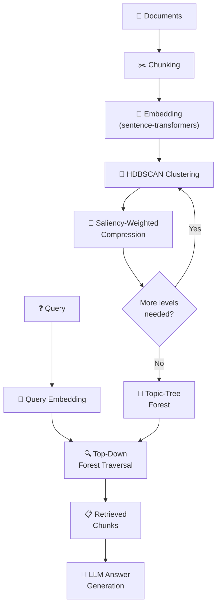

<div align="center">


<br>
*Hierarchical Vector Compression & Topic-Guided Retrieval for RAG*

[](https://opensource.org/licenses/Apache-2.0)
[](https://www.python.org/downloads/)
[](https://github.com/AnasAmchaar/HRAG/actions)
[](https://github.com/astral-sh/ruff)

*A novel RAG architecture that organizes document chunks into a hierarchical topic-tree forest, enabling efficient top-down retrieval that mirrors how humans navigate knowledge — from broad topics to specific details.*

[Quick Start](#-quick-start) · [How It Works](#-how-it-works) · [API Reference](#-api-reference) · [Contributing](#-contributing) · [Paper](#-paper)

</div>

---

## ✨ Features

- **🌲 Hierarchical Indexing** — Builds a topic-tree forest from document embeddings using HDBSCAN clustering and saliency-weighted vector compression
- **⚡ Efficient Retrieval** — Top-down forest traversal with O(D + B·L) comparisons vs O(N) for flat search
- **🔍 Topic-Guided Search** — Prunes irrelevant topic branches early, focusing computation on the most relevant subtrees
- **📊 Built-in Benchmarking** — Compare hierarchical vs flat retrieval side-by-side with latency and accuracy metrics
- **🤖 LLM Integration** — Pluggable answer generation with Ollama (local) or extractive fallback
- **📄 Multi-format Ingestion** — Supports PDF, TXT, and Markdown documents out of the box

## 🏗 How It Works



### Architecture Overview

H-RAG implements a four-level hierarchy: **Root → Topic → Subtopic → Leaf**

| Level | Role | Vector |
|-------|------|--------|
| **Root** | Domain-level entry point | Saliency-weighted mean of topic vectors |
| **Topic** | Broad thematic cluster | Compressed concept vector |
| **Subtopic** | Fine-grained sub-theme | Compressed concept vector |
| **Leaf** | Original document chunk | Raw embedding from encoder |

At query time, the retriever performs a **top-down BFS traversal**:
1. Score query against all root vectors → prune trees below threshold τ → keep top-B
2. At each surviving node, score children → prune below τ → keep top-B
3. Collect reached leaf nodes → rank by similarity → return top-k

## 🚀 Quick Start

### Installation

```bash
# From source (recommended for development)
git clone https://github.com/AnasAmchaar/HRAG.git
cd H-RAG
pip install -e ".[dev]"

# From PyPI (coming soon)
# pip install humanized-rag
```

### Basic Usage

**CLI:**

```bash
# Ingest documents
hrag ingest --source ./docs/

# Query the index
hrag query "What is semantic vector compression?"

# Compare hierarchical vs flat retrieval
hrag compare "How does topic-guided retrieval work?"

# View index statistics
hrag stats
```

**Python API:**

```python
from hrag import HumanizedRAGPipeline

# Initialize and ingest
pipeline = HumanizedRAGPipeline()
pipeline.ingest(source="./docs/")

# Query
result = pipeline.query("What is semantic vector compression?")
print(result["answer"])

# Access retrieval details
for chunk in result["results"]:
    print(f"  [{chunk.score:.3f}] {chunk.text[:100]}...")

# View latency breakdown
print(result["latency"])
```

### Configuration

All settings can be overridden via environment variables:

| Variable | Default | Description |
|----------|---------|-------------|
| `HRAG_EMBEDDING_MODEL` | `all-mpnet-base-v2` | Sentence-transformer model name |
| `HRAG_CHUNK_SIZE` | `384` | Target chunk size in tokens |
| `HRAG_CHUNK_OVERLAP` | `0.15` | Overlap ratio between chunks |
| `HRAG_MAX_TREE_DEPTH` | `4` | Maximum tree depth |
| `HRAG_SIMILARITY_THRESHOLD` | `0.5` | Pruning threshold (τ) |
| `HRAG_BRANCHING_FACTOR` | `3` | Max branches per level (B) |
| `HRAG_TOP_K` | `5` | Default number of results |
| `HRAG_STORAGE_DIR` | `./storage` | Index storage directory |
| `OLLAMA_BASE_URL` | `http://localhost:11434` | Ollama API endpoint |
| `OLLAMA_MODEL` | `llama3.2` | Ollama model for generation |

## 📖 API Reference

### `HumanizedRAGPipeline`

The main interface for H-RAG:

```python
from hrag import HumanizedRAGPipeline

pipeline = HumanizedRAGPipeline(index_path="./storage/forest_index.json")
```

| Method | Description |
|--------|-------------|
| `ingest(source, save=True)` | Ingest documents from file/directory and build the index |
| `query(question, k=5, tau=0.5, B=3, use_ollama=True)` | Query the index and generate an answer |
| `compare(question, k=5)` | Compare hierarchical vs flat retrieval |
| `load_index()` | Load a previously saved index |
| `stats()` | Return index statistics |

### Core Components

| Class | Description |
|-------|-------------|
| `TopicForest` | Forest of topic trees — the complete hierarchical index |
| `TopicTree` | A single topic tree with a root node |
| `TreeNode` | A node in the tree carrying a vector, level, and children |
| `Embedder` | Wrapper around sentence-transformers |
| `RetrievalResult` | A single result with text, score, and traversal path |
| `Chunk` | A document chunk with metadata |

## 🧪 Development

```bash
# Clone and install in development mode
git clone https://github.com/AnasAmchaar/HRAG.git
cd H-RAG
pip install -e ".[dev]"

# Run tests
pytest

# Run linter
ruff check hrag/

# Run type checker
mypy hrag/
```

See [CONTRIBUTING.md](CONTRIBUTING.md) for the full development guide.

## 📄 Paper

This implementation is based on the paper:

> **"Toward Human-Inspired RAG: Hierarchical Vector Compression and Topic-Guided Retrieval"**

If you use H-RAG in your research, please cite:

```bibtex
@article{hrag2026,
  title   = {Toward Human-Inspired RAG: Hierarchical Vector Compression and Topic-Guided Retrieval},
  year    = {2026},
}
```

## 🤝 Contributing

Contributions are welcome! Please see our [Contributing Guide](CONTRIBUTING.md) for details.

## 📜 License

This project is licensed under the Apache License 2.0 — see the [LICENSE](LICENSE) file for details.
